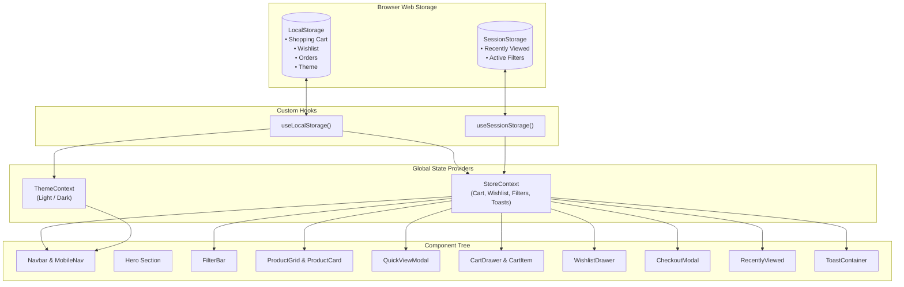

# ⚡ AURA Atelier // Modern Minimalist E-Commerce Platform

A production-ready, fully responsive, and visually stunning luxury E-Commerce web application built with **React**, **Vite**, **Tailwind CSS**, and **Lucide React**. 

Drawing inspiration from **shadcn/ui** and **React Bits**, the interface features refined micro-interactions, sleek card designs, smooth animations, glassmorphic headers, and an aesthetic that works across mobile, tablet, and desktop viewports.

---

## 🌟 Table of Contents
1. [Project Overview](#project-overview)
2. [Key Features](#key-features)
3. [Tech Stack & Dependencies](#tech-stack--dependencies)
4. [Project Directory & File Structure](#project-directory--file-structure)
5. [Complete File-by-File Breakdown](#complete-file-by-file-breakdown)
6. [Project Explanation Guide (For Presentations & Reviews)](#project-explanation-guide-for-presentations--reviews)
   - [Where each part comes from](#1-where-each-part-comes-from)
   - [How data flows between components](#2-how-data-flows-between-components)
   - [Why specific storage choices were made (LocalStorage vs. SessionStorage)](#3-why-specific-storage-choices-were-made)
   - [State management architecture & edge-case safety](#4-state-management-architecture--edge-case-safety)
7. [Getting Started & Local Development](#getting-started--local-development)

---

## 🚀 Project Overview

**AURA Atelier** is designed as a direct-to-consumer luxury platform showcasing precision electronics, minimalist footwear, heavyweight architectural apparel, and artisan accessories. 

The application implements a real-world shopping loop:
- **Discover:** Live multi-field search (press `/` to focus), category pill filtering, price slider, and stock status filters.
- **Inspect:** Quick View inspection modal with multi-angle image galleries, technical specs, and variant selectors (sizes, colors).
- **Save & Collect:** Wishlist system with badge counters and quick move-to-cart operations.
- **Transact:** Slide-over cart drawer with free shipping milestone progress bar, coupon code validation (`AURA20`, `WELCOME10`), live tax/shipping calculations, and an interactive checkout modal with `canvas-confetti` celebration and order receipt generation.

---

## 💎 Key Features

### 1. Responsive Layout & Navigation
- **Mobile-First Responsiveness:** Optimized grid breakpoints (`grid-cols-1 sm:grid-cols-2 md:grid-cols-3 lg:grid-cols-4`).
- **Glassmorphic Sticky Header:** Real-time search bar with keyboard shortcut (`/`), category navigation, dark/light theme switch, wishlist counter badge, and shopping cart trigger with dynamic badge count.
- **Mobile Bottom Navigation Dock:** Smartphone dock navigation (`Home`, `Explore`, `Wishlist`, `Cart`) for effortless one-handed thumb interaction.
- **Announcement Bar:** Dynamic header bar displaying promo codes and live distance to the complimentary free shipping threshold.

### 2. Product Catalog & Filtering
- **Rich Mock Catalog:** 12 curated products across Electronics, Footwear, Apparel, and Accessories with high-resolution imagery, star ratings, review counts, stock quotas, and specs.
- **Multi-Vector Filtering:**
  - Category tabs (`All`, `Electronics`, `Footwear`, `Apparel`, `Accessories`).
  - Real-time search across titles, descriptions, categories, and technical specs.
  - Price ceiling slider ($50 – $600).
  - In-stock only filter toggle.
  - Dynamic sorting (Featured, Price: Low to High, Price: High to Low, Highest Rated, Alphabetical).
- **Quick View Modal:** Full product deep-dive with variant pickers (sizes, colors), quantity increment/decrement bounded by live inventory, and specs chips.

### 3. Dual-Tier Storage Architecture
- **LocalStorage (Persistent across browser restarts & tabs):**
  - Shopping Cart items, quantities, and selected variant options.
  - Wishlist saved items.
  - Completed order receipts and order history.
  - Theme preference (`light` or `dark`).
- **SessionStorage (Scoped to current browser session/tab):**
  - "Recently Viewed Products" carousel that captures items inspected during the current browsing session without cluttering long-term storage.
  - Active search filter states (category, max price, sort order).

### 4. Interactive Shopping Cart & Checkout
- **Slide-Over Cart Drawer:** Smooth right-side drawer with bounded quantity adjusters, instant line total updates, and trash actions.
- **Free Shipping Progress Meter:** Animated visual progress bar indicating how close the customer is to unlocking free express shipping ($150 threshold).
- **Promo Code Engine:** Validates promo codes with instantaneous discounts:
  - `AURA20` — 20% off entire order.
  - `WELCOME10` — 10% welcome discount.
  - `VIP50` — $50 off orders over $200.
- **Simulated Checkout Modal:** Form validation (shipping details, simulated credit card with security masking), simulated SSL encryption, order placement processing delay, and a multi-burst confetti celebration (`canvas-confetti`) with an official order receipt and tracking ID.

### 5. Shadcn/ui & React Bits Aesthetics
- Clean neutral slate/zinc color palette with CSS variable tokens.
- Light & Dark mode support with persistent user preference.
- Micro-interactions: scale-down button press effects (`active:scale-95`), hover zoom image transitions, smooth dialog backdrops with blur, and floating toast notifications.

---

## 🛠️ Tech Stack & Dependencies

| Package | Purpose |
| :--- | :--- |
| **React 18** | UI component architecture and state management (`useState`, `useEffect`, `useMemo`, `useCallback`, `useContext`) |
| **Vite 6** | Lightning-fast build tool and development server with Hot Module Replacement (HMR) |
| **Tailwind CSS 3.4** | Utility-first CSS styling, responsive grid, dark mode classes, and custom keyframes |
| **Lucide React** | Clean, customizable modern icon set |
| **clsx & tailwind-merge** | Safe conditional class merging utility (`cn`) following the shadcn/ui pattern |
| **canvas-confetti** | High-performance canvas-based particle bursts for celebratory checkout confirmation |

---

## 📁 Project Directory & File Structure

```
Ecom/
├── index.html                     # HTML5 entry template with Plus Jakarta Sans & Space Grotesk fonts
├── package.json                   # Project dependencies, scripts, and build metadata
├── postcss.config.js              # PostCSS pipeline configuring Tailwind and Autoprefixer
├── tailwind.config.js             # Tailwind design tokens, animations, keyframes, and color variables
├── vite.config.js                 # Vite bundler configuration with React plugin
├── README.md                      # Comprehensive project documentation and explanation guide
└── src/
    ├── main.jsx                   # React root bootstrap file
    ├── App.jsx                    # Root coordinator component with layout, filtering, and modal mounting
    ├── index.css                  # Tailwind directives, CSS variables (shadcn theme), and custom utilities
    ├── lib/
    │   ├── utils.js               # Utility helpers: cn(), formatCurrency(), generateOrderId()
    │   └── constants.js           # Categories, promo codes, shipping rates, and sort options
    ├── data/
    │   └── products.js            # Mock dataset of 12 luxury products with images, specs, and stock
    ├── hooks/
    │   ├── useLocalStorage.js     # Custom hook for safe localStorage reads, writes, and cross-tab sync
    │   └── useSessionStorage.js   # Custom hook for tab-isolated sessionStorage reads and writes
    ├── context/
    │   ├── StoreContext.jsx       # Global application state (Cart, Wishlist, Filters, Toasts, Orders)
    │   └── ThemeContext.jsx       # Theme state provider (Dark/Light mode) with localStorage persistence
    └── components/
        ├── common/
        │   ├── Button.jsx         # Shadcn-inspired button component with variants and loading spinners
        │   ├── Badge.jsx          # Pill indicator badge with color variants (accent, destructive, warning)
        │   ├── Modal.jsx          # Accessible dialog with blur backdrop, body scroll lock, and ESC key listener
        │   ├── Drawer.jsx         # Slide-over panel component for Cart and Wishlist
        │   ├── StarRating.jsx     # Star rating component with partial star rendering and review count
        │   └── Toast.jsx          # Animated floating notification toasts with auto-dismiss
        ├── layout/
        │   ├── AnnouncementBar.jsx# Top ticker bar with shipping goals and active discount hints
        │   ├── Navbar.jsx         # Sticky glassmorphic header with search, theme switch, and drawer triggers
        │   ├── Hero.jsx           # Editorial hero banner with stats, collection tags, and call-to-actions
        │   ├── MobileNav.jsx      # Bottom dock navigation bar for mobile devices
        │   └── Footer.jsx         # Sleek footer with warranty guarantees, newsletter form, and links
        ├── products/
        │   ├── ProductCard.jsx    # Card with image hover-zoom, wishlist toggle, quick inspect, and add-to-cart
        │   ├── ProductGrid.jsx    # Responsive grid layout with empty state handling
        │   ├── FilterBar.jsx      # Category pills, price slider, in-stock toggle, and sort dropdown
        │   ├── QuickViewModal.jsx # Product inspection modal with gallery thumbnails and specs table
        │   └── RecentlyViewed.jsx # SessionStorage-powered recently viewed products section
        ├── cart/
        │   ├── CartDrawer.jsx     # Slide-over cart with free shipping bar, coupons, and checkout CTA
        │   └── CartItem.jsx       # Individual cart item row with variant options and quantity stepper
        ├── wishlist/
        │   └── WishlistDrawer.jsx # Slide-over wishlist with item list, move-to-cart, and clear options
        └── checkout/
            └── CheckoutModal.jsx  # Multi-step checkout form, payment simulation, and confetti receipt
```

---

## 🔍 Complete File-by-File Breakdown

### Configuration & Entry Points
1. **`index.html`**
   - Declares the HTML5 structure, loads Google Fonts (`Plus Jakarta Sans` for body text and `Space Grotesk` for headlines), and binds the root React mount element `<div id="root"></div>`.
2. **`vite.config.js`**
   - Configures Vite to bundle the application using `@vitejs/plugin-react` and specifies the local development port.
3. **`tailwind.config.js`**
   - Implements shadcn-compatible CSS variable tokens (`hsl(var(--primary))`, `hsl(var(--background))`, etc.), defines custom animation keyframes (`slideUp`, `scaleIn`, `shimmer`), and enables class-based dark mode (`darkMode: 'class'`).
4. **`src/index.css`**
   - Sets the base CSS theme variables for both light and dark modes, applies subtle scrollbar styling, and defines utility classes like `.glass-header` and `.glass-card`.
5. **`src/main.jsx`**
   - Bootstraps the React virtual DOM using `ReactDOM.createRoot` inside `<React.StrictMode>`.

### Utilities & Data
6. **`src/lib/utils.js`**
   - `cn(...inputs)`: Merges conditional class names cleanly without Tailwind class collisions using `clsx` and `tailwind-merge`.
   - `formatCurrency(amount)`: Formats numbers into currency format (e.g. `$349.00`).
   - `generateOrderId()`: Generates random order reference codes (e.g., `AUR-92K4Z1`).
7. **`src/lib/constants.js`**
   - Defines static store parameters including `CATEGORIES`, `SORT_OPTIONS`, active `PROMO_CODES`, `FREE_SHIPPING_THRESHOLD` ($150), `STANDARD_SHIPPING_COST` ($12), and `ESTIMATED_TAX_RATE` (8%).
8. **`src/data/products.js`**
   - Supplies 12 detailed mock products featuring high-res Unsplash photography, realistic pricing, review counts, stock quotas, tags, sizes, colors, and technical specifications.

### Storage Hooks & State Management
9. **`src/hooks/useLocalStorage.js`**
   - Encapsulates safe interaction with `window.localStorage`.
   - Protects against browser quota exceptions or private browsing restrictions with `try/catch`.
   - Dispatches a custom `local-storage-change` event and listens to the native `storage` event to ensure state stays synchronized across multiple tabs and components.
10. **`src/hooks/useSessionStorage.js`**
    - Interacts safely with `window.sessionStorage`.
    - Guarantees data isolation within the active tab/session and automatic garbage collection when the tab is closed.
11. **`src/context/ThemeContext.jsx`**
    - Manages dark/light theme state, syncs changes to `localStorage` (`aura-theme`), checks the OS `prefers-color-scheme`, and toggles the `.dark` CSS class on `document.documentElement`.
12. **`src/context/StoreContext.jsx`**
    - The central state hub of the application:
      - Combines cart and wishlist state via `useLocalStorage`.
      - Manages recently viewed products and active filters via `useSessionStorage`.
      - Computes cart quantities, subtotals, promo discounts, shipping qualifications, taxes, and final totals.
      - Dispatches temporary UI notifications via a built-in Toast queue.
      - Coordinates order placement and clears the cart on checkout completion.

### Common UI Components
13. **`src/components/common/Button.jsx`**
    - Reusable button supporting 6 variants (`default`, `secondary`, `outline`, `ghost`, `destructive`, `link`), multiple sizes, built-in loading spinners, and press scale transitions.
14. **`src/components/common/Badge.jsx`**
    - Pill badge component for product labels (`Bestseller`, `Sale`, `New Release`, `Limited Stock`).
15. **`src/components/common/Modal.jsx`**
    - Dialog container featuring backdrop blur, automatic body scroll locking, and dismissal via keyboard `Escape` or backdrop click.
16. **`src/components/common/Drawer.jsx`**
    - Slide-over panel component from the right viewport edge, used for the Cart and Wishlist interfaces.
17. **`src/components/common/StarRating.jsx`**
    - Visual star rating component supporting partial star fills, numeric scores, and review count indicators.
18. **`src/components/common/Toast.jsx`**
    - Floating animated notifications that appear upon adding items to the cart, updating the wishlist, or applying discount codes.

### Layout & Page Components
19. **`src/components/layout/AnnouncementBar.jsx`**
    - Top ribbon displaying discount code prompts and real-time distance from the free shipping threshold.
20. **`src/components/layout/Navbar.jsx`**
    - Sticky glassmorphic navigation bar with store branding, live search bar with `/` keyboard focus shortcut, desktop category navigation, theme toggle, wishlist count badge, and cart trigger badge.
21. **`src/components/layout/Hero.jsx`**
    - Editorial hero section highlighting key store value propositions and primary call-to-action buttons.
22. **`src/components/layout/MobileNav.jsx`**
    - Bottom fixed dock navigation providing mobile smartphone users with one-tap access to Home, Catalog, Wishlist, and Cart.
23. **`src/components/layout/Footer.jsx`**
    - Clean footer with value guarantees (30-day returns, 2-year warranty, carbon-neutral delivery), newsletter subscription form, and technical stack details.

### Product Catalog Components
24. **`src/components/products/ProductCard.jsx`**
    - Product card showcasing smooth image zoom transitions, top badges, wishlist toggle heart, quick inspect button, star ratings, stock warnings, and an instant add-to-cart button.
25. **`src/components/products/ProductGrid.jsx`**
    - Responsive product grid with an empty state fallback when no items match active filter criteria.
26. **`src/components/products/FilterBar.jsx`**
    - Filter controls including category tabs, search query tag, price range slider ($50–$600), in-stock toggle, and sort dropdown.
27. **`src/components/products/QuickViewModal.jsx`**
    - Inspection modal with image gallery thumbnails, product descriptions, variant selectors (sizes and colors), inventory-bounded quantity counter, and technical specs table.
28. **`src/components/products/RecentlyViewed.jsx`**
    - Displays products inspected during the current browsing session retrieved from `sessionStorage`.

### Cart, Wishlist & Checkout Components
29. **`src/components/cart/CartDrawer.jsx`**
    - Slide-over drawer with the list of cart items, shipping goal meter, promo code applicator, subtotal breakdown, empty cart state, and checkout action.
30. **`src/components/cart/CartItem.jsx`**
    - Cart row item with product thumbnail, variant labels, quantity stepper bounded by inventory, and item removal button.
31. **`src/components/wishlist/WishlistDrawer.jsx`**
    - Slide-over drawer for saved items with options to move items individually or entirely into the cart.
32. **`src/components/checkout/CheckoutModal.jsx`**
    - Interactive checkout flow with shipping address fields, simulated payment methods, order total review, processing delay simulation, and a celebratory confetti animation (`canvas-confetti`) with an official order receipt.

---

## 🎓 Project Explanation Guide (For Presentations & Reviews)

Use this section to clearly explain the architectural decisions, data flow, and storage choices behind the project.

### 1. Where each part comes from

- **shadcn/ui Design Philosophy:**
  Rather than relying on a heavy third-party component library with rigid styling, the UI components (`Button`, `Badge`, `Modal`, `Drawer`) follow the shadcn/ui pattern: accessible, headless building blocks styled with Tailwind CSS utility classes and CSS custom property color tokens (`hsl(var(--primary))`).
- **React Bits Micro-Interactions:**
  Card hover transforms, subtle active press scales (`active:scale-[0.98]`), backdrop blurs (`backdrop-blur-md`), and celebratory canvas particles deliver a modern, high-polish user feel.
- **Lucide Icons:**
  Standardized iconography across the application for visual consistency.
- **Single Source of Truth Mock Data:**
  Products in `src/data/products.js` emulate a real backend API response, containing unique IDs, categories, descriptions, variant arrays, pricing, stock levels, and technical specification objects.

---

### 2. How data flows between components



1. **Top-Level Providers:**
   `App.jsx` wraps the application tree inside `ThemeProvider` and `StoreProvider`.
2. **Context Consumers:**
   Components call the custom hook `useStore()` to access state and action dispatchers:
   - `Navbar` reads `cartCount`, `wishlistCount`, and `subtotal`.
   - `FilterBar` dispatches filter updates (`category`, `searchQuery`, `maxPrice`, `sortBy`) to `StoreContext`.
   - `App.jsx` performs memoized filtering (`useMemo`) over the product catalog based on active filter criteria.
   - `ProductCard` and `QuickViewModal` dispatch actions such as `addToCart`, `toggleWishlist`, and `recordProductView`.
   - `CartDrawer` updates quantities, validates promo codes, and forwards the customer to `CheckoutModal`.
   - `CheckoutModal` processes the simulated transaction, generates a unique order reference, writes to the order history, and clears the cart.

---

### 3. Why specific storage choices were made

One of the key technical decisions in this application is the deliberate separation between **LocalStorage** and **SessionStorage**:

| Feature | Storage Medium | Architectural Rationale |
| :--- | :--- | :--- |
| **Shopping Cart** | `localStorage` | **High Commercial Value & Purchase Intent.** A user expects items added to their cart to remain there when returning hours or days later, or after an accidental tab close or page reload. |
| **Wishlist** | `localStorage` | **Long-Term Collection.** Wishlisted items represent customer aspirational interest that should persist across sessions until deliberately removed or purchased. |
| **Order History** | `localStorage` | **Receipt Verification.** Preserves simulated order confirmations and receipts so customers can reference their transaction history across visits. |
| **Color Theme** | `localStorage` | **User Interface Preference.** Remembers whether the user preferred dark mode or light mode across visits. |
| **Recently Viewed** | `sessionStorage` | **Context-Specific to Current Browsing Session.** Recently viewed items are relevant to the immediate search journey. Storing them in `sessionStorage` avoids unbounded storage growth, respects privacy on shared devices, and cleans up automatically when the tab closes. |
| **Active Filters & Search** | `sessionStorage` | **Session Continuity Without Stale Traps.** Persisting filters in `sessionStorage` prevents losing filter configurations on page refreshes while ensuring that opening the website in a fresh tab starts with a clean catalog view. |

---

### 4. State management architecture & edge-case safety

1. **Safe Serialization & Deserialization:**
   `useLocalStorage` and `useSessionStorage` wrap all `JSON.parse` and `JSON.stringify` calls inside `try/catch` blocks. If storage contains corrupt data or is blocked by Safari Private Browsing mode, the hooks fall back to the provided `initialValue` without crashing the application.
2. **Cross-Tab Synchronization:**
   The `useLocalStorage` hook listens to the window `storage` event. If a customer modifies their cart or wishlist in Tab A, Tab B updates its state immediately.
3. **Inventory Clamping:**
   Both `addToCart` and `updateCartQuantity` enforce upper bounds using `product.stock`. A user cannot increment a quantity beyond the available stock limit.
4. **Derived Computations via `useMemo`:**
   Cart subtotal, discount amounts, shipping qualifications, and tax calculations are derived dynamically using `useMemo`. This prevents stale state desynchronization and unnecessary re-renders.

---

## 💻 Getting Started & Local Development

### Prerequisites
- **Node.js**: Version 18.x or 20.x or higher
- **npm**: Version 9.x or higher

### Installation & Run

1. Clone or navigate to the repository directory:
   ```bash
   cd /home/blaze/Documents/Ecom
   ```

2. Install dependencies:
   ```bash
   npm install
   ```

3. Launch the development server:
   ```bash
   npm run dev
   ```
   Open your browser to the local URL (typically `http://localhost:3000` or `http://localhost:5173`).

4. Build for production:
   ```bash
   npm run build
   ```

5. Preview production build locally:
   ```bash
   npm run preview
   ```

---

## 🏷️ Test Coupons for Evaluation
- `AURA20`: 20% discount on any order size
- `WELCOME10`: 10% welcome discount
- `VIP50`: $50 flat discount on orders over $200
